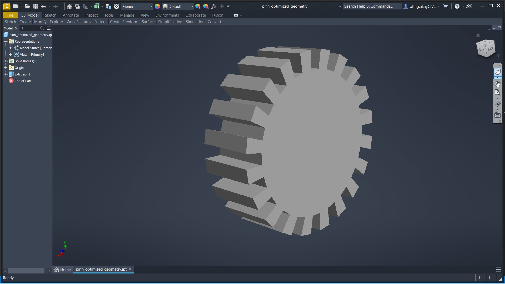

# Physics-Informed Digital Twin for Autonomous Component Sizing

## 1. Project Description
This repository contains a closed-loop engineering deployment pipeline that automates the transition from raw metallurgical characteristics to verified 3D solid geometry models. Designed as a standalone framework for advanced industrial R&D, the pipeline optimizes component geometry based on custom material boundaries and structural load configurations, completely bypassing manual draft iterations.

The application architecture executes across four distinct functional phases:
* **Data Auditing & Quarantine Layer:** Ingests raw manufacturing logs, evaluates row-level metallurgical entries against physical constraints, and isolates non-physical anomalies into a dedicated isolation directory to safeguard model training.
* **Physics-Informed Neural Network (PINN):** A deep learning framework built to evaluate alloy profiles (such as case-hardened vs. through-hardened domains). The model operates via a custom loss function constrained by active mechanical equations—evaluating contact stress capacity ($\sigma_H$) and bending stress limits ($\sigma_F$) rather than relying purely on statistical regression.
* **Geometric Parameter Bridge:** Translates raw normalized model tensors back into standard engineering units, compiling structural dependencies like tooth module values, pitches, and face widths into a production-ready payload.
* **Topologically Continuous CAD Automation Engine:** Connects directly to the host CAD software backend to draw and generate validated 3D solids without micro-gap or open-loop vertex fragmentation anomalies.

---

## 2. Core Software Stack & Environment
To execute the automation pipeline, the host system must run a dual-runtime environment linking an active machine learning ecosystem to a local parametric graphics engine.

### Machine Learning & Data Processing Pipeline
* **Python 3.10+:** Core execution runtime engine.
* **TensorFlow / Keras:** Deep learning environment hosting the custom neural network layer architectures and loss functions.
* **Pandas & NumPy:** Matrix manipulation and production data array handling.
* **Scikit-Learn:** Minimum-maximum scaling configuration and dataset serialization.

### Parametric CAD Automation Engine
* **Autodesk Inventor Professional:** Primary solid-modeling graphics engine used to generate the final part files (`.ipt`).
* **PyWin32 (Win32 COM API Client):** High-speed Object Linking and Embedding (OLE) automation canvas used to establish the continuous point-chaining connection directly into Autodesk Inventor's active process space.

---

## 3. Proof of Concept
The successful generation of a verified 3D spur gear part asset—driven completely by physics-bound material predictions via the automated API pipeline—is illustrated below:

*Figure 1.1: Parametric 3D solid model generated in Autodesk Inventor via the continuous COM point-chaining sketch routine.*